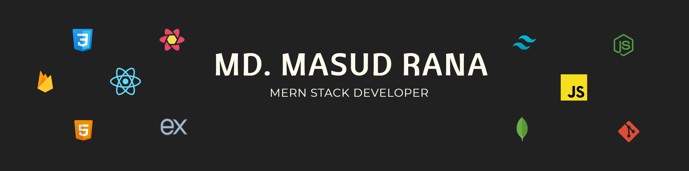

📌 _Here are a few things that describe me:_

- 📠 I'm currently pursuing my BSc degree in computer science & engineering
- 🔭  Personal goal ─ Will spend more time learning new and advanced technologies
- 💻  I spend most of my time writing JavaScript on both the front-end and back-end
- 🌱  I’m currently learning TypeScript
- 💬  Ask me about javascript, I'll be happy to help
- 📫  _How to reach me:_ [Linkedin](https://www.linkedin.com/in/masud-rana-in/) | [Email](mailto:masudrana4488@gmail.com) 🚀
<!-- - ⚡ &nbsp;_Fun fact:_ I ❤️ what I am doing!!😄 -->

### 💻 Technologies that I know

<code></code>
<code></code>
<code></code>
<code></code>
<code></code>
<code></code>
<code></code>
<code></code>
<code></code>
<code></code>
<code></code><code></code>
<code></code>
<code></code>
<code></code>
<code></code>

 

### Problem Solving Skills

## Current Stats

<picture></picture>

